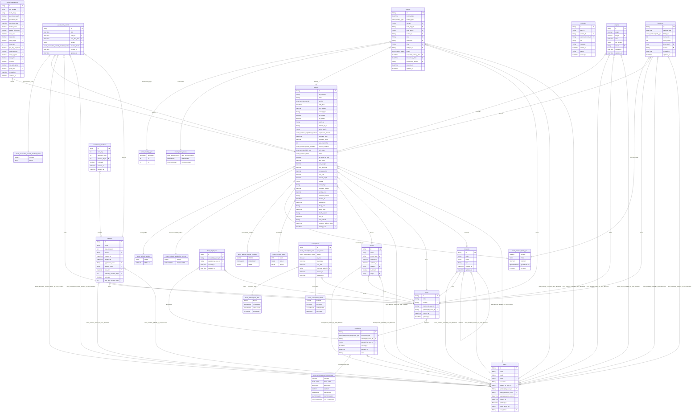

```mermaid
erDiagram

        enum_animals_acquisition_method {
            BORN BORN
PURCHASED PURCHASED
        }
    


        enum_animals_birth_type {
            SINGLE SINGLE
TWIN TWIN
TRIPLET TRIPLET
QUADRUPLET QUADRUPLET
OTHERS OTHERS
        }
    


        enum_animals_female_condition {
            MATED MATED
PREGNANT PREGNANT
NONE NONE
        }
    


        enum_animals_gender {
            MALE MALE
FEMALE FEMALE
        }
    


        enum_animals_status {
            LIVE LIVE
SOLD SOLD
DEAD DEAD
        }
    


        enum_employees_employee_type {
            OWNER OWNER
EMPLOYEE EMPLOYEE
BUTCHER BUTCHER
AGENT AGENT
MANAGER MANAGER
SUPERVISOR SUPERVISOR
VETERINARIAN VETERINARIAN
        }
    


        enum_vaccination_records_creation_mode {
            SINGLE SINGLE
MASS MASS
        }
    


        enum_mating_type {
            NATURAL NATURAL
AI AI
ET ET
        }
    


        enum_mating_status {
            NOT_SUCCESSFUL NOT_SUCCESSFUL
PREGNANT PREGNANT
MISCARRIAGE MISCARRIAGE
        }
    


        enum_subscription_plan {
            BASIC BASIC
STANDARD STANDARD
ADVANCED ADVANCED
ULTIMATE ULTIMATE
        }
    


        enum_subscription_status {
            ACTIVE ACTIVE
EXPIRED EXPIRED
CANCELLED CANCELLED
PENDING PENDING
        }
    
  "animals" {
    String id "🗝️"
    String tag_number 
    String color "❓"
    enum_animals_gender gender 
    DateTime birth_date "❓"
    Decimal birth_weight "❓"
    String animal_type "❓"
    Boolean is_breeder "❓"
    Boolean is_qurbani "❓"
    String batch_no "❓"
    String mother_tag_id "❓"
    String father_tag_id "❓"
    enum_animals_acquisition_method acquisition_method 
    DateTime purchase_date "❓"
    Decimal purchase_price "❓"
    Int age_in_months "❓"
    enum_animals_female_condition female_condition "❓"
    enum_animals_birth_type birth_type "❓"
    enum_animals_status status 
    Boolean is_ready_for_sale "❓"
    Decimal sale_price "❓"
    Decimal sale_weight "❓"
    Decimal sale_discount "❓"
    Decimal net_sale_price "❓"
    Decimal sale_rate "❓"
    Decimal current_weight "❓"
    String remark "❓"
    String teeth_stage "❓"
    Decimal purchase_weight "❓"
    Decimal landing_cost "❓"
    String treatment_record "❓"
    DateTime created_at 
    DateTime updated_at 
    String image_url "❓"
    DateTime death_date "❓"
    String death_reason "❓"
    DateTime sold_at "❓"
    String sold_remark "❓"
    DateTime expected_delivery_date "❓"
    DateTime mating_date "❓"
    }
  

  "breeds" {
    String id "🗝️"
    String name 
    String animal_type "❓"
    DateTime created_at 
    DateTime updated_at 
    String category "❓"
    Boolean is_default 
    String origin "❓"
    }
  

  "employees" {
    String id "🗝️"
    enum_employees_employee_type employee_type 
    String created_by_user_id "❓"
    String updated_by_user_id "❓"
    DateTime created_at 
    DateTime updated_at 
    String state 
    }
  

  "farm_employees" {
    String id "🗝️"
    String created_by_user_id "❓"
    String updated_by_user_id "❓"
    DateTime created_at 
    DateTime updated_at 
    }
  

  "farms" {
    String id "🗝️"
    String name 
    String location "❓"
    String created_by_user_id "❓"
    String updated_by_user_id "❓"
    DateTime created_at 
    DateTime updated_at 
    }
  

  "locations" {
    String id "🗝️"
    String code 
    String name 
    String type 
    DateTime created_at 
    DateTime updated_at 
    }
  

  "users" {
    String id "🗝️"
    String name 
    String email "❓"
    String phone "❓"
    String password 
    String created_by_user_id "❓"
    String updated_by_user_id "❓"
    String reset_password_token "❓"
    DateTime reset_password_expires "❓"
    DateTime created_at 
    DateTime updated_at 
    String profile_photo_url "❓"
    String push_token "❓"
    }
  

  "vaccination_records" {
    String id "🗝️"
    DateTime date 
    DateTime valid_till "❓"
    DateTime next_due_date "❓"
    String remark "❓"
    enum_vaccination_records_creation_mode creation_mode 
    DateTime created_at 
    DateTime updated_at 
    }
  

  "vaccines" {
    String id "🗝️"
    String name 
    Int days_between 
    String remark "❓"
    DateTime created_at 
    DateTime updated_at 
    String application_route "❓"
    String disease_name "❓"
    Decimal dose_ml "❓"
    Int immunity_duration_days "❓"
    Boolean is_default 
    Int next_due_duration_days "❓"
    }
  

  "weights" {
    String id "🗝️"
    Decimal weight 
    Decimal height "❓"
    DateTime date 
    String tag_number 
    String remark "❓"
    DateTime created_at 
    DateTime updated_at 
    }
  

  "vaccination_schedules" {
    String id "🗝️"
    Int start_day 
    Int repetition_days 
    Int duration_days "❓"
    Boolean is_default 
    DateTime created_at 
    DateTime updated_at 
    }
  

  "animal_transactions" {
    String id "🗝️"
    String tag_number 
    String teeth_stage "❓"
    Decimal purchase_weight "❓"
    Decimal purchase_rate "❓"
    DateTime purchase_date "❓"
    Decimal landing_cost "❓"
    Decimal weight_difference "❓"
    DateTime sale_date "❓"
    Decimal sale_rate "❓"
    Decimal sale_weight "❓"
    Int stay_days "❓"
    Decimal per_day_expense "❓"
    Decimal total_expense "❓"
    Decimal cost_of_goat "❓"
    Decimal sale_price "❓"
    Decimal discount "❓"
    Decimal net_sale_price "❓"
    Decimal profit_loss "❓"
    DateTime created_at 
    DateTime updated_at 
    }
  

  "reminders" {
    String id "🗝️"
    String user_id 
    String animal_id "❓"
    String vaccine_record_id "❓"
    String title 
    String message 
    DateTime remind_at 
    String status 
    DateTime created_at 
    }
  

  "matings" {
    String id "🗝️"
    DateTime mating_date 
    enum_mating_type mating_type 
    String remark "❓"
    String male_tag_id "❓"
    String male_breed "❓"
    String semen_id "❓"
    String dose "❓"
    String technician "❓"
    String time "❓"
    String embryo_id "❓"
    enum_mating_status status 
    DateTime expected_delivery_date "❓"
    DateTime miscarriage_date "❓"
    String miscarriage_reason "❓"
    DateTime created_at 
    DateTime updated_at 
    }
  

  "breedings" {
    String id "🗝️"
    DateTime delivery_date 
    enum_animals_birth_type birth_type 
    Int num_male 
    Int num_female 
    Json kids_details "❓"
    String remark "❓"
    DateTime created_at 
    DateTime updated_at 
    }
  

  "subscriptions" {
    String id "🗝️"
    enum_subscription_plan plan_name 
    enum_subscription_status status 
    Boolean is_trial 
    DateTime start_date 
    DateTime end_date 
    String cashfree_order_id "❓"
    DateTime created_at 
    DateTime updated_at 
    }
  
    "animals" |o--|| "enum_animals_gender" : "enum:gender"
    "animals" |o--|| "enum_animals_acquisition_method" : "enum:acquisition_method"
    "animals" |o--|o "enum_animals_female_condition" : "enum:female_condition"
    "animals" |o--|o "enum_animals_birth_type" : "enum:birth_type"
    "animals" |o--|| "enum_animals_status" : "enum:status"
    "animals" }o--|| "breeds" : "breeds"
    "animals" }o--|o "users" : "users_animals_created_by_user_idTousers"
    "animals" }o--|| "farms" : "farms"
    "animals" }o--|o "locations" : "locations"
    "animals" }o--|o "users" : "users_animals_updated_by_user_idTousers"
    "breeds" }o--|o "users" : "users_breeds_created_by_user_idTousers"
    "breeds" }o--|o "farms" : "farms"
    "breeds" }o--|o "users" : "users_breeds_updated_by_user_idTousers"
    "employees" |o--|| "enum_employees_employee_type" : "enum:employee_type"
    "employees" }o--|| "users" : "users"
    "farm_employees" }o--|| "employees" : "employees"
    "farm_employees" }o--|| "farms" : "farms"
    "farms" }o--|| "employees" : "employees"
    "locations" }o--|o "users" : "users_locations_created_by_user_idTousers"
    "locations" }o--|| "farms" : "farms"
    "locations" |o--|o "locations" : "locations"
    "locations" }o--|o "users" : "users_locations_updated_by_user_idTousers"
    "vaccination_records" |o--|| "enum_vaccination_records_creation_mode" : "enum:creation_mode"
    "vaccination_records" }o--|| "animals" : "animals"
    "vaccination_records" }o--|o "users" : "users_vaccination_records_created_by_user_idTousers"
    "vaccination_records" }o--|| "farms" : "farms"
    "vaccination_records" }o--|o "users" : "users_vaccination_records_updated_by_user_idTousers"
    "vaccination_records" }o--|| "vaccines" : "vaccines"
    "vaccines" }o--|o "users" : "users_vaccines_created_by_user_idTousers"
    "vaccines" }o--|o "farms" : "farms"
    "vaccines" }o--|o "users" : "users_vaccines_updated_by_user_idTousers"
    "weights" }o--|| "animals" : "animals"
    "weights" }o--|o "users" : "users_weights_created_by_user_idTousers"
    "weights" }o--|| "farms" : "farms"
    "weights" }o--|o "users" : "users_weights_updated_by_user_idTousers"
    "vaccination_schedules" }o--|| "vaccines" : "vaccines"
    "animal_transactions" }o--|| "animals" : "animals"
    "matings" |o--|| "enum_mating_type" : "enum:mating_type"
    "matings" |o--|| "enum_mating_status" : "enum:status"
    "matings" }o--|| "animals" : "animals"
    "matings" }o--|| "farms" : "farms"
    "matings" }o--|o "users" : "users_matings_created_by_user_idTousers"
    "matings" }o--|o "users" : "users_matings_updated_by_user_idTousers"
    "breedings" |o--|| "enum_animals_birth_type" : "enum:birth_type"
    "breedings" }o--|| "animals" : "animals"
    "breedings" }o--|| "farms" : "farms"
    "breedings" }o--|o "users" : "users_breedings_created_by_user_idTousers"
    "breedings" }o--|o "users" : "users_breedings_updated_by_user_idTousers"
    "subscriptions" |o--|| "enum_subscription_plan" : "enum:plan_name"
    "subscriptions" |o--|| "enum_subscription_status" : "enum:status"
    "subscriptions" |o--|| "farms" : "farms"
```
